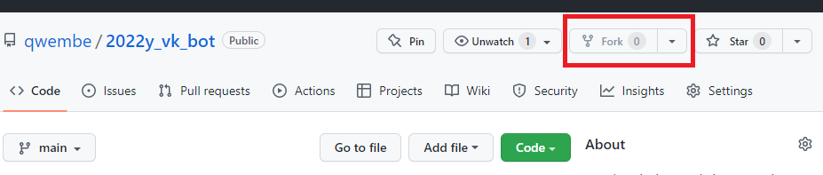
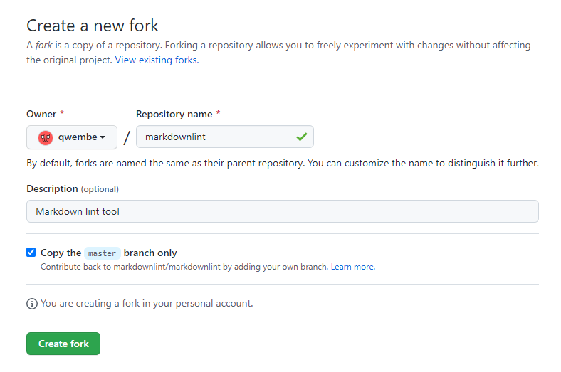
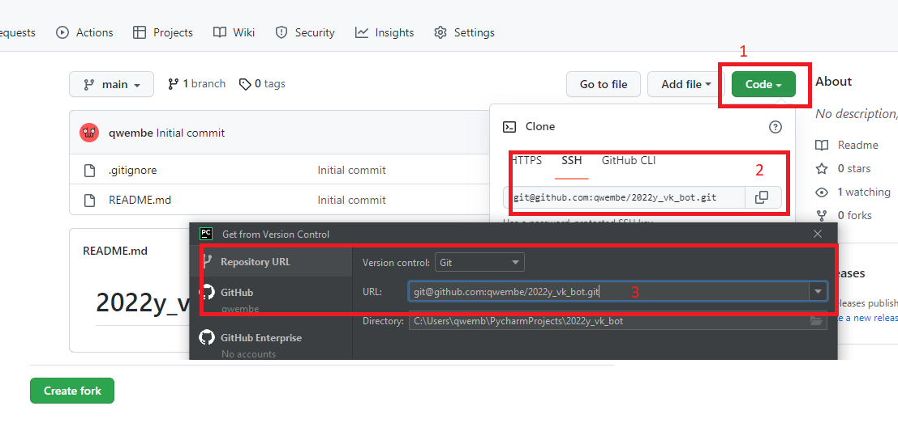
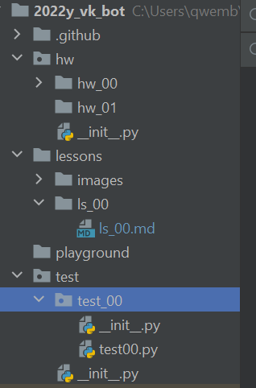
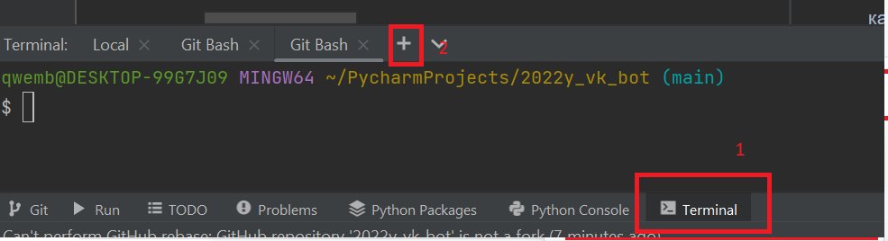
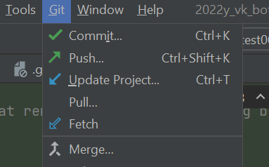

# 2022y_vk_bot

### Цель 
- Cделать первый коммит своего приложения
- Написать первую функцию
- Запушить изменения

### Задачи
- Установить необходимое ПО ([PyCharm](https://www.jetbrains.com/ru-ru/pycharm/),[Git](https://git-scm.com/),GitBash,[Python,Pip](https://www.python.org/ftp/python/3.7.9/python-3.7.9-amd64.exe))
- Сделать форк от проекта, на котором будут выкладываться задачи
- Склонировать проект к себе при помощи PyCharm
- Сделать домашки
- Пройти тесты
- Сделать коммит 
- Запушить изменения к себе

### Подробнее  
1) На мой взгляд самый удобный редактор - это [PyCharm](https://www.jetbrains.com/ru-ru/pycharm/), легок в установке и хороший помощник для написания и поддержки проектов

* Что такое **GitHub & Git** и в чем отличие: 
> [Git](https://git-scm.com/) - это система/программа контроля версий, который 
> выполняет много различных функций: Сохранение изменений (commit), откат до контрольной точки (rebase), ответвление (branch), кооперация с другими программистами при помощи gitlab'a или GitHub.

> [GitHub](https://github.com/) & [GitLub](https://about.gitlab.com/)- это сайт/сервер, который хостит тысячи проектов. Через этот ресурс преимущественно происходит коллаборация проектов. Так же для удобства и ускорения разработки можно настроить автотесты для автоматической проверки

* GitBash - это эмулятор Linux bash, который можно установить на windows

* Python 
* Pip - это менеджер пакетов, которые можно легко устанавливать к себе для работы с ними

2) Следующий шаг - это клонирование к себе этого проекта. 


Это называется форк. Форк это полноценное клонирование чужого репозитория к себе в аккаунт.



Теперь в можно увидеть у себя в аккаунте этот туториал, выполнять задачки и тестировать свои хотелки

3) Нужно склонировать своей проект при помощи. Надо найти вкладку **VCS** (version control system) | **Enable Version Control Integration**



4) Теперь проект должен будет выглядеть вот так вот - 


5) Теперь настроим так, что бы изменения с моего репозитория можно было загружать и работать у себя
Воспользуемся терминалом (см. внизу редактора) - нажать на плюс, и выбрать GitBash


В терминале нужно ввести следующие команды 

```sh
# Add the remote, call it "upstream":

git remote add upstream https://github.com/qwembe/2022y_vk_bot

# Fetch all the branches of that remote into remote-tracking branches

git fetch upstream

# Make sure that you're on your master branch:

git checkout master

# Rewrite your master branch so that any commits of yours that
# aren't already in upstream/master are replayed on top of that
# other branch:

git rebase upstream/master
```

Теперь при помощи *Pull* & *Fetch* Можно забирать изменения из этого репозитория и подтягивать их к себе

6) Тест. 
> 1. Установить при помощи pip pip-install-test и проверить 
и проверить это запустив функцию pip_install_verification()
```shell
pip install pip-install-test
```


> 2. Нужно написать замечательную функцию - расчет расстояния по двум точкам
```python
# hw/hw_00/main.py

def my_distant(point1: tuple = (1, 1), point2: tuple = (2, 2)):
    """
    Нужно написать функцию, которая будет получать 2 кортежа из 2-ух чисел и находить расстояние между ними
    :param point1: Точка в пространстве
    :param point2:
    :return: Евклидово расстояние между точками
    """
    return 0 + 0  # YOUR CODE
```
Проверить себя можно запустив тесты из папки test/test_00/test00.py
или 
```shell
python -m unittest
```

7) Чтобы зафиксировать результат необходимо сохранить (закомитить) изменения и загрузить (запушить) их к себе. 
Это можно сделать при помощи средств PyCharm (Git | Commit & Git | Push)
или при помощи командой строки 
```shell
git status

git add .

git commit -m "my first commit"

git push
```